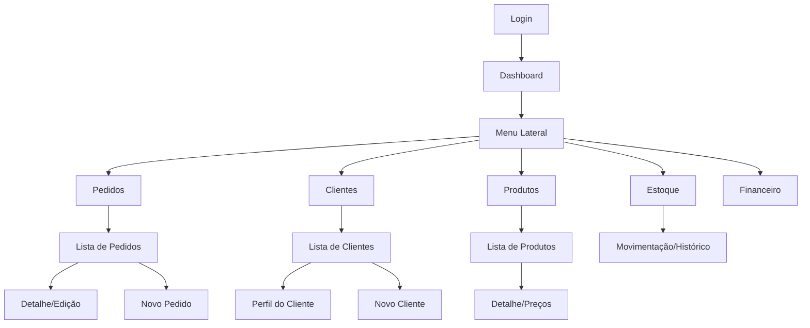

# Mapa do Sistema Comercial — Antigravity Industrial

Este documento fornece uma visão completa da arquitetura, fluxo e interface do sistema, permitindo análise sem necessidade de acesso direto.

---

## 1. Visão Geral (PRD)

O sistema é uma plataforma de gestão comercial robusta projetada para operações industriais e de atacado. Ele foca em três pilares: **Controle de Vendas**, **Gestão de Estoque** e **Saúde Financeira**.

### Módulos Principais
*   **Vendas (Pedidos)**: Gestão do ciclo de vida das vendas, desde o orçamento até a entrega e baixa financeira.
*   **CRM (Clientes)**: Visão 360º do cliente, incluindo histórico de compras, prazos médios e alertas de inadimplência.
*   **Logística (Produtos & Estoque)**: Catálogo com controle de margens (markup) e gestão de estoque físico em tempo real.
*   **Financeiro (Contas a Receber)**: Controle de recebíveis com fluxos de baixa e análise de inadimplência.

---

## 2. Mapa do Site e Fluxograma de Navegação

A navegação é centrada em uma barra lateral dinâmica que conecta todos os centros de controle.



---

## 3. Hierarquia Visual e Layout (Screenshots)

Abaixo estão as capturas das telas principais, demonstrando a estética **Industrial Premium** (fundo escuro na sidebar, cards brancos com sombras suaves e tipografia de alta legibilidade).

### 3.1 Dashboard Central
O ponto de comando do gestor. Surfa dados reais com indicadores semânticos (verde para sucesso, âmbar para atenção).


### 3.2 Listagem de Pedidos
Foco em produtividade. Filtros rápidos e badges de status para identificação imediata de gargalos.


### 3.3 Gestão de Clientes
Interface limpa que prioriza o contato e a identificação do cliente.


### 3.4 Catálogo de Produtos
Exibição técnica com foco em SKU, Categorias e Status de Estoque.


---

## 4. Estrutura Técnica (HTML/CSS)

O sistema utiliza um sistema de design baseado em variáveis CSS para garantir consistência industrial. Exemplo de estrutura de um Card de Dashboard:

```html
<article class="rf-dash-card is-success">
  <span class="rf-stat-label">LUCRO BRUTO</span>
  <span class="rf-stat-value">R$ 485,10</span>
  <span class="rf-stat-sub success">
    <svg>...</svg> Margem 54.0%
  </span>
</article>
```

**Principais Tokens de Design:**
```css
:root {
  --color-background-primary: #FFFFFF;
  --color-background-tertiary: #F8FAFC; /* Fundo do App */
  --color-sidebar-bg: #0F172A;        /* Sidebar Dark */
  --color-brand-gold: #C5A059;       /* Detalhes de Marca */
  --radius-xl: 0.75rem;              /* Arredondamento padrão */
}
```

---

## 5. Sequência de Uso Comum

1.  **Venda**: O vendedor acessa **Pedidos** -> **Novo Pedido**, seleciona o **Cliente** e os **Produtos**.
2.  **Conferência**: O gestor visualiza no **Dashboard** o impacto no faturamento.
3.  **Financeiro**: Após a entrega, o pedido gera uma conta em **Contas a Receber**, onde é processada a baixa após o pagamento.
