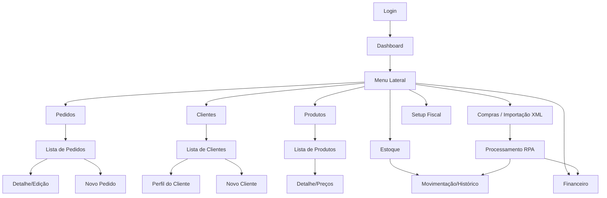

# Mapa do Sistema Comercial — Nexus Industrial

Este documento fornece uma visão completa da arquitetura, fluxo e interface do sistema, permitindo análise sem necessidade de acesso direto.

---

## 1. Visão Geral (PRD)

O sistema é uma plataforma de gestão comercial robusta projetada para operações industriais e de atacado sob a marca **Nexus Industrial**. Ele foca em três pilares: **Controle de Vendas**, **Gestão de Estoque** e **Saúde Financeira**.

### Módulos Principais
*   **Vendas (Pedidos)**: Gestão do ciclo de vida das vendas, desde o orçamento até a entrega e baixa financeira.
*   **CRM (Clientes)**: Visão 360º do cliente, incluindo histórico de compras, prazos médios e alertas de inadimplência.
*   **Logística (Produtos & Estoque)**: Catálogo com controle de margens (markup), gestão de estoque físico em tempo real e integração via RPA de compras.
*   **Financeiro (Contas a Receber e Pagar)**: Controle de recebíveis com fluxos de baixa, análise de inadimplência, e integração automática com Pedidos de Compra via XML.
*   **Fiscal (Governança)**: Motor tributário centralizado para cálculo de impostos (ICMS, PIS, COFINS, IVA Dual) via NCM/UF e mapeamentos de CFOP.

---

## 2. Mapa do Site e Fluxograma de Navegação

A navegação é centrada em uma barra lateral dinâmica que conecta todos os centros de controle.



---

## 3. Hierarquia Visual e Layout (Nexus Premium)

O sistema utiliza a estética **Nexus Premium Industrial**, caracterizada por:
- **Dark Mode Profundo**: Base em `Midnight Blue` (`#020617`).
- **Glassmorphism**: Uso intensivo de transparências e desfoque (`backdrop-blur`) em painéis e modais.
- **Destaque Ciano**: Acentuação em `Cyan Vibrante` para ações principais e indicadores de progresso.
- **Performance**: Carregamento sob demanda (Lazy Loading) para navegação instantânea.

### 3.1 Dashboard Central
O ponto de comando do gestor. Utiliza gráficos de alta fidelidade com gradientes vibrantes para faturamento e lucro.


### 3.2 Listagem de Pedidos
Foco em produtividade. Filtros rápidos e badges de status para identificação imediata de gargalos.


### 3.3 Gestão de Clientes
Interface limpa que prioriza o contato e a identificação do cliente.


### 3.4 Catálogo de Produtos
Exibição técnica com foco em SKU, Categorias e Status de Estoque.


---

## 4. Estrutura Técnica (Nexus Design System)

O sistema utiliza tokens semânticos baseados em variáveis CSS modernos.

**Principais Tokens de Design:**
```css
:root {
  --surface-page: #020617;    /* Fundo principal */
  --surface-card: #0f172a;    /* Fundo de cards */
  --text-accent: #06b6d4;     /* Ciano Nexus */
  --action-success: #10b981;  /* Esmeralda */
  --radius-premium: 12px;     /* Bordas refinadas */
}
```

---

## 5. Sequência de Uso Comum

1.  **Venda**: O vendedor acessa **Pedidos** -> **Novo Pedido**, seleciona o **Cliente** e os **Produtos**.
2.  **Conferência**: O gestor visualiza no **Dashboard** o impacto no faturamento em tempo real.
3.  **Financeiro**: Após a entrega, o pedido gera uma conta em **Contas a Receber**, onde é processada a baixa após o pagamento.
