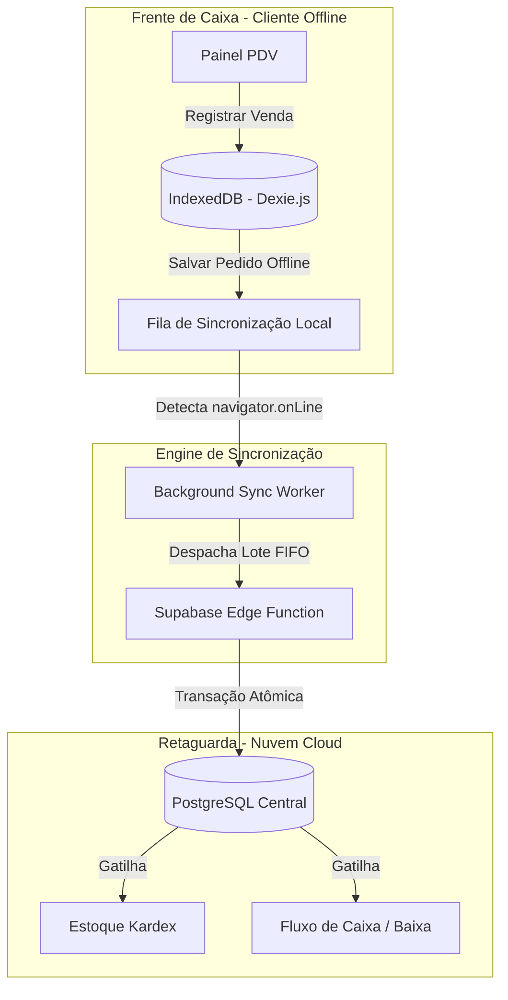

# 🗺️ Roadmap de Arquitetura e Implementação ERP — Nexus Industrial

Este documento detalha o planejamento de engenharia de software de alto nível para a modernização do ERP e PDV da plataforma **Nexus Industrial**. O plano foca em resiliência offline para o Frente de Caixa (PDV), inteligência tributária centralizada (compatível com a Reforma Tributária), automação RPA de Notas Fiscais via XML de entrada e conciliação bancária automatizada por algoritmos heurísticos.

---

## 🛠️ Tecnologias e Arquitetura de Base do Repositório

Após análise estrutural e do arquivo de dependências do repositório, mapeou-se a seguinte pilha de tecnologias do ecossistema do **Sistema Comercial**:
*   **Runtime & Compilação**: Vite + React 19 (Canary com suporte nativo a View Transitions) + TypeScript.
*   **Banco de Dados & Backend**: Supabase (PostgreSQL com Row Level Security (RLS) habilitado, políticas baseadas em Filiais, e RPCs em PL/pgSQL).
*   **Gerenciamento de Estado**: Zustand (modularizado por domínio com padrões de Store compactos).
*   **Comunicação**: TanStack React Query v5 (cache eficiente de consultas HTTP e mutações) interagindo diretamente com PostgREST e funções RPC.
*   **Acessibilidade & UI**: Tailwind CSS v4 + Design Tokens customizados B2B Premium (Anti-Slop, foco acessível e consistência de cores).

---

## 🎯 Fase 1: Resiliência do Ponto de Venda (PDV) e Motor Tributário

### 1.1 Sincronização Offline do PDV (Frente de Caixa)
**Objetivo**: Garantir operabilidade 100% ininterrupta do PDV, mesmo em cenários de queda completa de conexão com a internet.



#### Ações de Engenharia:
1.  **Armazenamento Local Estruturado (Offline Storage)**:
    *   Integrar a biblioteca **Dexie.js** para gerenciar a persistência local via **IndexedDB** do navegador.
    *   Estruturar schemas locais offline para:
        *   `offline_produtos` (dados rápidos de produtos, código de barras/EAN, preços, NCM, regras fiscais básicas e saldo de estoque de segurança).
        *   `offline_clientes` (dados resumidos de identificação e CNPJ/CPF).
        *   `offline_pedidos` (pedidos criados localmente, utilizando UUIDs v4 gerados na origem para chaves primárias, eliminando qualquer colisão).
        *   `offline_caixa_movimentos` (abertura, fechamento, suprimentos e sangrias offline).
2.  **Mecanismo de Fila Assíncrona (Sync Queue)**:
    *   Implementar uma Store Zustand persistente (`SyncQueueStore`) integrada com o `localStorage` do navegador para enfileirar as ações em ordem cronológica (FIFO).
    *   Desenvolver um gerenciador de rede dinâmico monitorando eventos `window.addEventListener('online')` e `navigator.onLine`.
    *   Criar rotina de sincronização baseada em lotes (batch sync) que processa as vendas offline registradas na fila local assim que a rede for restabelecida, acionando a RPC central de forma transacional.
    *   **Resolução de Conflitos**: A nuvem é a fonte de verdade absoluta para custos e saldos agregados, porém as vendas realizadas localmente prevalecem nas transações fiscais daquela filial. O estoque é debitado na nuvem via "delta de quantidade" para evitar distorções de concorrência multi-dispositivos.

---

### 1.2 Contingência Fiscal NFC-e (tpEmis = 9)
**Objetivo**: Permitir a emissão e impressão do Cupom Fiscal do Consumidor Eletrônico (NFC-e) mesmo offline, assinando e estruturando o XML localmente para transmissão posterior.

#### Ações de Engenharia:
1.  **Geração e Assinatura do XML Local**:
    *   Implementar um gerador local de estrutura XML para NFC-e (modelo 65) no padrão exigido pelo Manual de Orientação do Contribuinte (MOC) da SEFAZ.
    *   Projetar mecanismo de guarda segura do Certificado Digital A1 do cliente (armazenado de forma criptografada com algoritmo AES-GCM no IndexedDB local, desbloqueado via senha em memória do operador).
    *   Integrar biblioteca JS de criptografia XML para assinar digitalmente as tags `<infNFe>` do cupom localmente.
2.  **Lógica de Contingência (tpEmis = 9)**:
    *   Ao falhar a comunicação direta com os webservices da SEFAZ por mais de 15 segundos, o sistema chaveia automaticamente para o modo de contingência NFC-e (`tpEmis = 9`).
    *   Computar o QR Code local contendo a URL de consulta de contingência do estado de origem, gerando a chave de acesso da NFC-e utilizando o CNPJ da filial, código numérico, série e data.
    *   Montar e renderizar o DANFE NFC-e de contingência em formato térmico de 80mm com a marcação "Emitida em Contingência" impressa em destaque.
    *   Salvar o XML assinado na fila local prioritária de contingência (`NfceContingencyQueue`).
    *   Criar worker de transmissão automática que envia em lote os cupons emitidos em contingência em até 24 horas após o restabelecimento da internet, acionando webservice central via Supabase Edge Function e salvando o recibo de autorização.

---

### 1.3 Motor Tributário Centralizado
**Objetivo**: Eliminar alíquotas fiscais e regras de impostos inseridas de forma estática no código frontend/backend, centralizando a lógica tributária brasileira em uma matriz de regras no banco de dados.

```
Regra Tributária Resolvida Dinamicamente:
[Filial UF Origem] x [Cliente UF Destino] x [Perfil Cliente (Contrib/Não Contrib)] x [NCM/CEST] 
  = Matriz Tributária (ICMS, CSOSN, CST, PIS, COFINS, IPI)
```

#### Ações de Engenharia:
1.  **Modelagem Fiscais no Banco de Dados (Matrizes Fiscais)**:
    *   **`public.fiscal_ncms`**: Cadastro completo de NCMs (Nomenclatura Comum do Mercosul), CESTs e respectivas alíquotas de tributação aproximada municipal/estadual/federal baseadas na tabela do **IBPT**.
    *   **`public.fiscal_regras_tributacao`**: Configuração central de alíquotas e CST/CSOSN, mapeadas por UF de origem da Filial, UF de destino do Cliente, tipo de operação (Venda, Devolução, Brinde, Remessa) e enquadramento do destinatário (Contribuinte ICMS, Isento, Simples Nacional).
    *   **`public.fiscal_aliquotas_icms`**: Matriz de ICMS interestadual com cálculo automático de MVA (Margem de Valor Agregado), pICMS, pCredSN, redução de base de cálculo e Difal (Diferencial de Alíquota).
    *   **`public.fiscal_pis_cofins`**: CSTs e alíquotas padrão de PIS e COFINS de acordo com o regime tributário da Filial (Lucro Presumido, Real ou Simples Nacional).
2.  **Engenharia da RPC de Resolução Fiscal (`public.calcular_tributos_item`)**:
    *   Desenvolver a função PL/pgSQL `public.calcular_tributos_item(p_filial_id text, p_cliente_id text, p_produto_id text, p_qty numeric, p_preco_unitario numeric)` que:
        1. Resolve a UF da filial e a UF/perfil fiscal do cliente.
        2. Carrega o NCM e CEST do produto correspondente.
        3. Identifica a regra tributária correspondente na matriz de regras.
        4. Calcula os impostos nominais e efetivos (Base ICMS, Valor ICMS, Base Substituição Tributária (se aplicável), Valor ST, Crédito ICMS Simples Nacional, PIS, COFINS e Tributação Aproximada do IBPT).
        5. Retorna uma estrutura JSONB tipada contendo os valores e bases prontos para serem vinculados à venda, itens do pedido e nota fiscal.

---

### 1.4 Preparação para a Reforma Tributária (IVA Dual)
**Objetivo**: Projetar a coexistência do regime tributário clássico com a transição do IVA Dual (IBS - Imposto sobre Bens e Serviços, CBS - Contribuição sobre Bens e Serviços, e IS - Imposto Seletivo).

#### Ações de Engenharia:
1.  **Versionamento Temporal (Effective Dating)**:
    *   Adicionar campos `data_inicio_vigencia` e `data_fim_vigencia` em todas as tabelas de matriz de impostos e regras fiscais.
    *   Permitir que regras antigas de PIS/COFINS/ICMS coexistam no mesmo schema com as novas regras da reforma tributária, sendo selecionadas dinamicamente com base na data de emissão do pedido/documento fiscal.
2.  **Evolução do Schema de Banco de Dados**:
    *   Adicionar as colunas no schema de itens de vendas/compras e notas fiscais:
        *   `cbs_cst` (Código de Situação Tributária da CBS).
        *   `cbs_aliquota` (Alíquota nominal da CBS).
        *   `cbs_base` (Base de cálculo reduzida/integral da CBS).
        *   `cbs_valor` (Valor líquido calculado da CBS).
        *   `ibs_cst`, `ibs_aliquota`, `ibs_base`, `ibs_valor` (Imposto sobre Bens e Serviços).
        *   `is_aliquota`, `is_base`, `is_valor` (Imposto Seletivo / "Imposto do Pecado").
3.  **Refatoração do Motor de Cálculo Fiscal**:
    *   Adaptar a RPC `public.calcular_tributos_item` para avaliar se a data de emissão está dentro da janela de vigência da reforma tributária.
    *   Integrar fórmulas de cálculo "por fora" (exclusão do IBS/CBS da sua própria base de cálculo, conforme regulamentação) em contraste com o cálculo clássico por dentro do ICMS.

---

## 🤖 Fase 2: Automação RPA (XML e Conciliação Bancária OFX)

### 2.1 Parsing de XML de Notas Fiscais de Fornecedores e Cadastro Automatizado
**Objetivo**: Automatizar a entrada de mercadorias no estoque e o contas a pagar através do processamento de XMLs de NF-e emitidas por fornecedores.

```
XML File Upload 
  --> [Parsing Engine (DOMParser)] 
  --> [De-Para CFOP translation] 
  --> [Inventory Ingestion (Kardex)]
  --> [Finance Generation (Contas a Pagar)]
```

#### Ações de Engenharia:
1.  **Robustez no Parsing do XML (Tags Fiscais)**:
    *   Evoluir o [xmlInvoiceParser.ts](file:///Users/larrat/Sites/sistema_comercial/src/react/features/compras/lib/xmlInvoiceParser.ts) para capturar o cabeçalho completo da nota, chaves de acesso, informações das duplicatas (`<dup>`), frete, despesas acessórias e impostos não recuperáveis.
    *   Extrair dados tributários detalhados de cada item, incluindo NCM, CST/CSOSN, CFOP de origem do fornecedor, valor unitário e IPI.
2.  **Mapeamento Inteligente de CFOP (Entrada/Saída)**:
    *   Criar tabela no banco de dados `public.fiscal_cfop_mapeamento` mapeando o CFOP impresso na nota do fornecedor (de saída) para o CFOP de entrada equivalente do nosso sistema, avaliando:
        *   Se a operação é interna (mesmo estado) ou interestadual.
        *   Destinação da mercadoria (Uso e Consumo, Revenda/Industrialização ou Ativo Imobilizado).
        *   Exemplo: Se CFOP do XML = `5102`/`6102` (Venda de mercadoria) e finalidade = Revenda, traduzir automaticamente para CFOP `1102`/`2102` (Compra para industrialização ou comercialização).
3.  **Vínculo e Cadastro Automático de Produtos**:
    *   Criar a tabela `public.fornecedor_produto_vinculo` para associar o código do produto no fornecedor (`cProd` do XML) ao ID do nosso produto no sistema.
    *   Se houver GTIN/EAN (`cEAN`) válido no XML, buscar automaticamente o produto correspondente no banco.
    *   Se não for encontrado correspondência por EAN ou associação prévia:
        *   Apresentar modal interativo na interface para o operador "Associar a um produto existente" ou "Cadastrar como novo produto".
        *   Ao cadastrar como novo, inferir o nome, NCM, código de barras e precificação baseada em regras de Markup parametrizadas na filial.

---

### 2.2 Ingestão de Estoque (Kardex) e Alimentação Financeira Automática
**Objetivo**: Fazer com que o fechamento da importação da Nota Fiscal de Compra execute todas as baixas e provisões contábeis no banco de forma transacional.

#### Ações de Engenharia:
1.  **Ingestão Transacional de Estoque (Kardex)**:
    *   Desenvolver a RPC `public.compra_importar_xml_estoque(p_pedido_compra_id text, p_itens jsonb)` que:
        *   Insere as movimentações de entrada física (`tipo = 'entrada'`) no Kardex (`public.movimentacoes`) para cada produto importado.
        *   Atualiza o custo médio de aquisição do produto diretamente na tabela `public.produtos`, considerando o custo unitário líquido (custo bruto + IPI + frete rateado - créditos de ICMS e PIS/COFINS recuperáveis se a empresa for regime tributário normal).
2.  **Provisão Automática no Contas a Pagar**:
    *   Extrair o bloco de cobrança `<cobr>` e duplicatas `<dup>` do XML.
    *   Gerar automaticamente os lançamentos na tabela de `public.contas_pagar` com as datas de vencimento exatas e parcelas especificadas pelo fornecedor no XML.
    *   Se a forma de pagamento for identificada como à vista (Pix, Dinheiro, Débito imediato), efetuar o débito automático no fluxo de caixa (`public.caixa_transacoes`) integrado.

---

### 2.3 Conciliação Bancária OFX com Algoritmo Heurístico
**Objetivo**: Desenvolver uma engine inteligente para parear automaticamente as transações contidas em extratos bancários padrão OFX com as contas a pagar e receber em aberto no sistema, minimizando o trabalho manual do operador financeiro.

```
Transação OFX (Data, Valor, Memo/Nome)
                      x
Títulos no Sistema (Vencimento, Valor, Cliente/Fornecedor)
                      ||
            [Algoritmo Heurístico]
                      ||
            Score final (0 a 100)
    -> Score >= 80  : Match Automático (Verde)
    -> 50 <= Score < 80 : Match Sugerido (Amarelo)
    -> Score < 50   : Sem Vínculo (Requer Ação)
```

#### Ações de Engenharia:
1.  **Refinamento do `ofxService.ts`**:
    *   Garantir a extração limpa dos campos `FITID` (ID único do banco), `DTPOSTED` (Data de liquidação), `TRNAMT` (Valor com sinal positivo/negativo) e `MEMO`/`NAME` (Histórico de transação).
2.  **Desenvolvimento do Algoritmo Heurístico de Pareamento**:
    *   Implementar a função de scoring no frontend ou backend que calcula a correlação entre uma transação bancária e os títulos em aberto (Contas a Pagar/Receber):
        *   **Regra 1: Comparação de Valor (Peso de 50 pontos)**:
            *   Se o valor do título é idêntico ao da transação bancária (convertendo sinais de débito/crédito), atribui **50 pontos**.
            *   Se o valor difere por tolerâncias de juros/descontos configurados (até 2% do valor do título), atribui **25 pontos**.
        *   **Regra 2: Proximidade de Datas (Peso de 30 pontos)**:
            *   Se a data da transação coincide exatamente com o vencimento/recebimento do título, atribui **30 pontos**.
            *   A cada dia de diferença (tolerância de até 5 dias), subtrai 5 pontos do peso. Exemplo: 2 dias de diferença = **20 pontos**.
        *   **Regra 3: Similaridade de Texto (Nome/Memo) (Peso de 20 pontos)**:
            *   Calcular a similaridade textual (usando fórmulas simplificadas de distância Levenshtein ou busca por substring de palavras-chave) entre a descrição da transação (`MEMO` ou `NAME`) e o nome do Cliente / Fornecedor do título.
            *   Se houver match direto ou similaridade acima de 75%: atribui **20 pontos**.
            *   Se houver correspondência parcial de termos: atribui **10 pontos**.
3.  **Processamento dos Matches e Interface Visual**:
    *   Classificar e ordenar os resultados no componente `<ConciliacaoBancaria />`:
        *   `Score >= 80`: **Match Perfeito** (Habilita botão de confirmação em um único clique ou conciliação em lote pré-selecionada).
        *   `50 <= Score < 80`: **Match Sugerido** (Exibe o título sugerido em destaque com badge amarelo, permitindo que o usuário confirme ou altere o vínculo).
        *   `Score < 50`: **Pendente** (Abre drawer lateral de busca avançada em tempo real sobre os títulos em aberto no sistema para vinculação manual, ou permite "Lançar Direto no Caixa" como tarifa, transferência ou receita direta).

---

## 📈 Próximos Passos e Fluxo de Execução

1.  **Aprovação deste Roadmap**: O desenvolvedor revisa e aprova o plano de arquitetura.
2.  **Execução em Lote**:
    *   *Fase 1 (PDV Resiliente e Tributação)*: Criação das migrations das tabelas matrizes de impostos, triggers de cálculo temporal, suporte offline IndexedDB no frontend e contingência local NFC-e.
    *   *Fase 2 (Automação RPA)*: Implementação de parsing de XML detalhado, CFOP mapping, geração automática de contas a pagar/receber e o motor heurístico de conciliação bancária OFX.

### Fase 3: Interfaces Operacionais e Governança Fiscal

#### 3.1 Dashboard de Conciliação Bancária
**Objetivo**: Integrar a Engine Heurística do OFX à interface do usuário.
*   Conectar `ofxService.correlateTransactions` no componente `ConciliacaoBancaria.tsx`.
*   Buscar contas a pagar e receber pendentes para alimentar a engine.
*   Exibir badges visuais de Score (Match Perfeito, Sugerido e Pendente).

#### 3.2 Fechamento Transacional de XML de Compra
**Objetivo**: Substituir o salvamento comum pela nova arquitetura transacional.
*   Atualizar `PedidoCompraCreateRoutePage.tsx`.
*   Chamar a RPC `compra_importar_xml_estoque` para movimentar o Kardex.
*   Chamar a RPC `compra_importar_xml_financeiro` para provisionar o Contas a Pagar/Caixa.

#### 3.3 Configuração do Motor Tributário Centralizado
**Objetivo**: Interface para a equipe contábil configurar regras e exceções.
*   Criar UI de governança fiscal (CRUD da tabela `fiscal_regras_tributacao`).
*   Permitir a gestão da vigência (`data_inicio_vigencia`), preparando para a Reforma Tributária.
